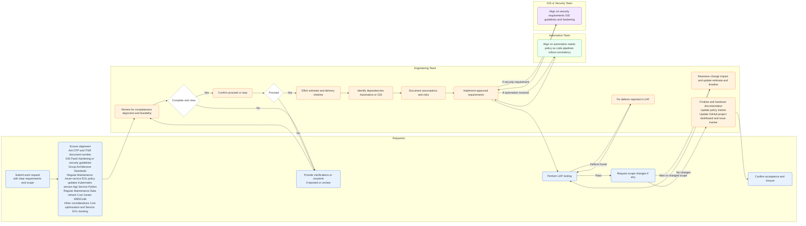

## **1. Request Submission**
- **Requestor** submits a work request with **clear requirements and defined scope**.
- **Requestor** makes sure the submitted requirements **must align** with the following standards and guidelines:  
  - **AIA Standards** – including details from **CPP** with **ITSR** document number.  
  - **GIS Guidelines** – such as **PaaS Hardening** or other security guidelines. 
  - **Group Architecture Standards** - including details from the related documents.
  - **Regular Maintenance Requirements**, including:  
    - Policy updates related to **Azure service EOL**, such as Kubernetes version upgrade, App Service Python version EOL.
    - Data refresh such as Cost Center, WBSCode, etc.
  - **Other Considerations**, such as:  
    - **Cost optimization**,  
    - **Service EOL tracking**

---

## **2. Requirement Assessment**
- **Engineering Team** reviews the submitted request for completeness, alignment, and feasibility.  Incomplete or unclear requirements will be rejected and requestor needs to submit a new new request.
- The team seeks clarification where needed and confirms whether to **proceed** or **stop** the request 

---

## **3. Effort Estimation & Planning**
- Once the request is approved to proceed, **Engineering Team**:  
  - Provides **effort estimation** and a **delivery timeline**,  
  - Identifies dependencies (e.g., Automation or GIS teams),  
  - Documents key **assumptions and risks**.  

---

## **4. Implementation & Collaboration**
- **Engineering Team** implements the approved requirements.  
- If the request involves **automation**, the team must align with the **Automation Team** to ensure consistency with existing automation.
- **Engineering Team** to align with **GIS Team** if this is a security requirement.

---

## **5. Testing & Defect Resolution**
- The **Requestor** performs **testing (UAT)** to validate that requirements are met.  
- The **Engineering Team** reviews and fixes any reported defects.

---

## **6. Change Request Handling**
- If the **Requestor** introduces new or changed requirements outside the original scope:  
  - The **Engineering Team** reassesses the impact,  
  - Provides updated **effort and timeline estimates**,  
  - Seeks confirmation from the Requestor before proceeding with additional work.  

---

## **7. Closure**
- Upon successful testing and validation:  
  - The **Requestor** confirms **acceptance and closure**,  
  - The **Engineering Team** completes final documentation, such as
    - Updates to the policy tracker. 
    - Updates in GitHub project dashboard and issue tracker.

---

