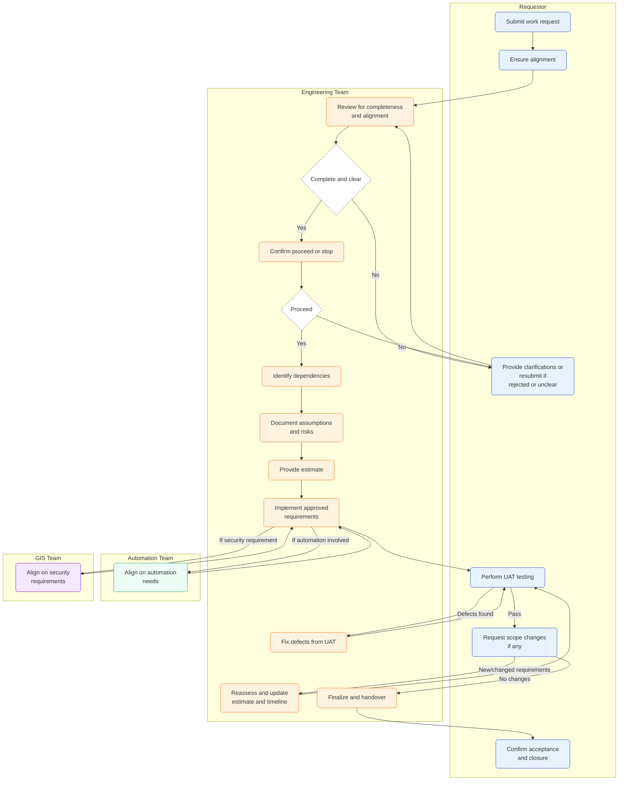

## **1. Request Submission**

- **Requestor** submits a work request with **clear requirements and scope**.
- Requirements must align with at least one of the following:
  - **AIA Standards** – referencing details from **CPP** and an **ITSR** document number.
  - **GIS Guidelines** – such as **PaaS Hardening** or other security guidelines.
  - **Group Architecture Standards** – with supporting documents.
  - **Regular Maintenance** – e.g.,
    - Policy updates for **Azure service EOL**, such as Kubernetes version upgrade, App Service Python version EOL.
    - Data refresh such as Cost Center, WBSCode, etc.
  - **Other Considerations** – e.g., **cost optimization**, **service EOL tracking**.

---

## **2. Requirement Assessment**

- **Engineering Team** reviews the submitted request for completeness, alignment, and feasibility. Incomplete or unclear requirements will be rejected and requestor needs to submit a new request.
- The team seeks clarification where needed and confirms whether to **proceed** or **stop** the request.

---

## **3. Effort Estimation & Planning**

- Once the request is approved to proceed, **Engineering Team**:
  - Identifies dependencies (e.g., Automation or GIS teams),
  - Documents key **assumptions and risks**,
  - Provides **effort estimation** and a **delivery timeline**.

---

## **4. Implementation & Collaboration**

- **Engineering Team** implements the approved requirements.
- If the request involves **automation**, the team must align with the **Automation Team** to ensure consistency with existing automation.
- **Engineering Team** to align with **GIS Team** if this is a security requirement.

---

## **5. Testing & Defect Resolution**

- **Requestor** performs **testing (UAT)** to validate that requirements are met.
- **Engineering Team** reviews and fixes any reported defects.

---

## **6. Change Request Handling**

- If **Requestor** introduces new or changed requirements outside the original scope:
  - **Engineering Team** reassesses the impact,
  - Provides updated **effort and timeline estimates**,
  - Seeks confirmation from the **Requestor** before proceeding with additional work.

---

## **7. Closure**

- Upon successful testing and validation:
  - **Requestor** confirms **acceptance and closure**,
  - **Engineering Team** completes final documentation, such as
    - Updates to the policy tracker.
    - Updates in GitHub project dashboard and issue tracker.

---

## Process Flow

